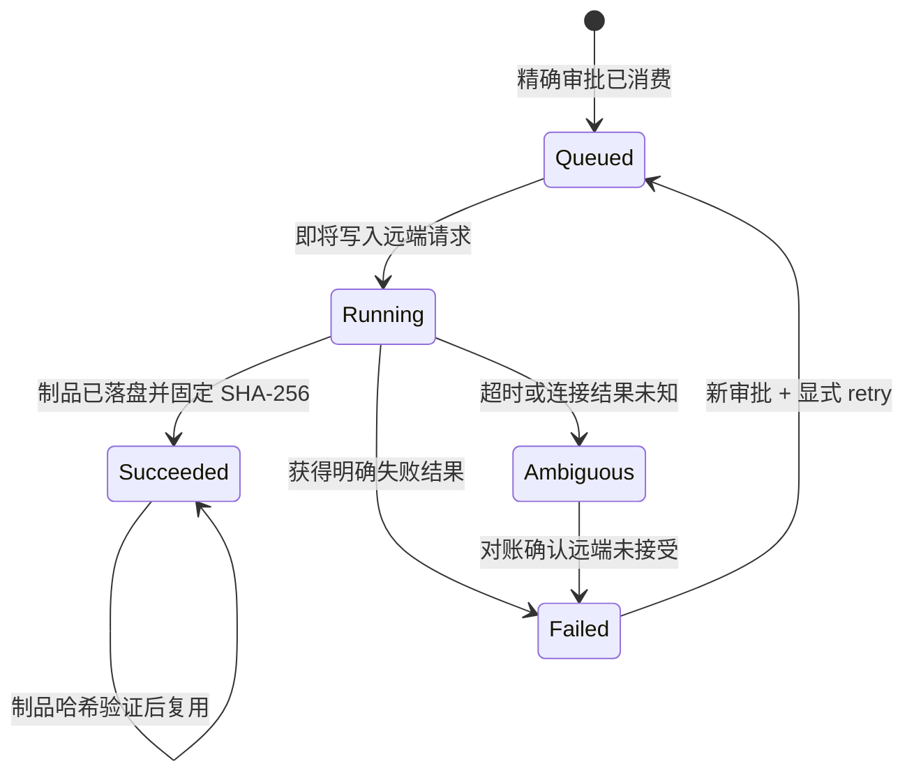

# 云端 TTS 幂等与费用门禁

云端 TTS adapter 只负责协议映射。任何可能计费的网络提交必须先通过
`TtsLedgerStore::prepare`，并持有与当前请求完全匹配、未过期且未消费的审批。

## 幂等键

幂等键是以下字段的长度分帧 SHA-256：

- Provider ID；
- 执行模式：`production` 或 `live_canary`；
- 完整统一请求的稳定 JSON；
- 目标草稿绝对路径。

账本只保存文本哈希、请求哈希、Provider、模型、音色、目标、预算与状态，不保存原始文本、
凭据值或凭据引用名称。并发首次提交使用原子 `create_new` claim；如果进程在 claim 存在但账本
尚未落盘时崩溃，后续请求按 `ambiguous` 拒绝，而不是猜测远端未收到请求。

## 状态与重提规则

普通 `prepare` 永远不会重提 `queued`、`running`、`failed` 或 `ambiguous` 请求。成功结果只有在
制品仍存在且 SHA-256 匹配时才能复用；缺失或漂移会 fail closed。

## 审批绑定

审批绑定以下内容：

- `tts.cloud.submit` 或独立的 `tts.cloud.live-canary` 命令；
- provider、model、voice；
- 文本 SHA-256、完整请求 SHA-256；
- 目标草稿、任务 ID、工作目录；
- 最大费用微单位。

任何字段变化都会导致审批不匹配。真实付费 canary 不能复用普通生产审批；离线回环测试只使用
一次性 fixture 凭据与 mock HTTP 服务，不访问厂商、不消费真实额度。

根 CLI 的 `media tts --provider <cloud> --plan` 覆盖首批七家云 provider：它先执行对应
adapter 的 capability 和协议参数校验，再输出上述审批绑定、幂等键、endpoint、凭据引用名与
预算。输出不包含原始文本或秘密值，且不会创建或修改草稿。

提交时必须去掉 `--plan` 并提供 `--approval-id`、`--approval-root` 与可选
`--tts-state-root`。CLI 在消费审批前完成 endpoint、请求与凭据形状预检；审批匹配后才把账本
置为 running 并执行一次厂商 HTTP 请求。4xx 属于明确拒绝并进入 failed；5xx、连接中断、超时、
无法解码的成功响应、远端 URL 下载失败或本地原子落盘失败均进入 ambiguous。成功音频按
SHA-256 记录并纳入草稿 MutationPlan；草稿事务后续失败时，再次调用会复用已验证音频而不重提
付费请求。

`--cloud-endpoint-override` 是隐藏的离线测试开关，只接受无凭据的 HTTP 回环地址，并额外要求
显式设置 `JIANYING_ALLOW_TTS_ENDPOINT_OVERRIDE=1`。生产路径固定要求 adapter 提供 HTTPS endpoint。
当前能力仍保持 `partial`：网络执行链已有回环黑盒证据，火山 adapter 已使用官方 V3 单向
SSE endpoint 和专用 `X-Api-*` 请求头，并验证多音频帧拼接、终止帧与错误帧；但七家真实账号的
单独授权付费 canary 尚未执行。
