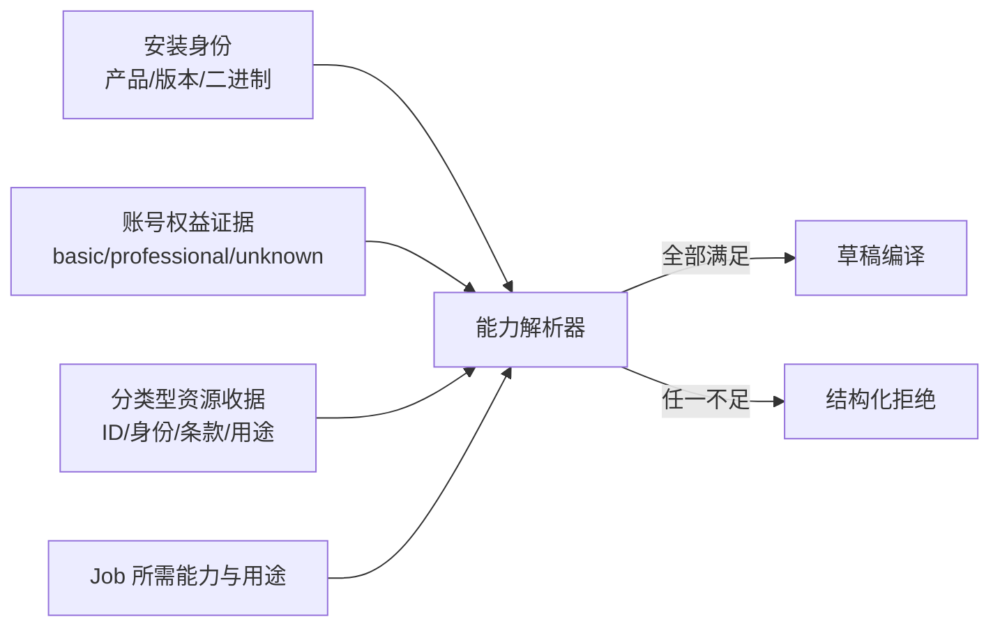

## Context

现有 `jianying-runtime` 已能验证产品、精确版本、可执行文件身份、草稿根和 capability，但 `RuntimeProfile` 没有账号权益或素材授权概念。剪映安装包的显示名长期包含“专业版”，这不是账号订阅证据。官方资源通过 GUI 呈现，资源条款、可下载状态和账号权益可能动态变化，不能编译进静态 capability manifest。用户提供的当前界面证据显示视频/图片、音乐、文字、贴纸、画面特效和转场具有不同的列表结构、权益标记和应用前置条件。

## Goals / Non-Goals

**Goals:**

- 让 CLI 稳定区分安装身份、账号版型和单项素材授权。
- 让基础版/专业版路由成为可测试、可过期、fail-closed 的机器契约。
- 为插件 GUI Adapter 提供最小交接面，不把 GUI 自动化放入领域核心。
- 保持旧 Runtime Profile 和纯本地素材 Job 可读取。

**Non-Goals:**

- 不逆向账号数据库、Cookie、会员接口或剪映私有下载协议。
- 不绕过素材水印、下载限制、地域限制或单项授权。
- 不声称专业订阅自动授予广告、转售、人物肖像或商标用途。
- 不在 CLI 中用屏幕坐标实现素材搜索和下载。

## Decisions

### 1. 三层身份而不是一个 `pro` 布尔值

`RuntimeProfile` 继续描述安装与静态能力。新增独立权益快照与素材收据，避免旧 profile 反序列化破坏，也避免把短期账号状态固化进发布二进制。替代方案是在 profile 中增加 `professional: true`，但它无法表达过期、未知和单项素材限制，因此拒绝。

### 2. 权益只接受最小化、可过期的观察证据

权益快照只保存版型、状态、观察方式、观察时间、失效时间和允许的能力集合。账户只允许不可逆本地指纹，且默认不要求指纹。Cookie、Token、昵称、手机号和邮箱全部禁止落盘。

首个 GUI 观察器由插件产生 `gui_observed` 证据；CLI 只验证 schema、时效和能力，不假装自己登录或调用会员接口。未来如果剪映提供官方公开 API，可新增证据提供者而不改变领域契约。

### 3. 每个官方资源使用分类型不可变收据

收据使用稳定资源 ID 加内容身份绑定实际资源，记录资源类型、单项权益标记、来源页面/条款引用、取得时间、允许用途和限制。视频、图片和音乐优先使用下载文件 SHA-256；贴纸、特效、转场和文字模板允许使用“草稿资源 ID + 资源节点规范化摘要 + 草稿快照摘要”形成身份。Job 编译时重新校验对应身份。资源更新、重新下载或条款变化生成新收据，不覆盖旧证据。

资源类型首版包括 `media`、`music`、`text_template`、`sticker`、`video_effect`、`transition`、`caption_style`、`smart_package`、`smart_b_roll`、`filter`、`adjustment`、`template`、`digital_human`、`animation`、`sound_effect` 和 `unknown`。`unknown` 只保留观察证据，禁止自动应用。

菱形图标映射为 `professional_candidate`，限免映射为 `limited_free_candidate`，无标记映射为 `unclassified`；这些都是观察值，必须结合实际下载/应用结果和条款证据才能提升为可交付状态。

### 4. 专业版是能力上限，不是版权豁免

能力解析器先检查权益，再检查素材收据和目标用途。即便账号为专业版，缺少条款、仅预览、用途不匹配或人物/商标需要额外授权时仍拒绝自动交付。插件可以提示用户选择其他素材，但 CLI 不自动替换，避免语义和授权漂移。

### 5. GUI 仅负责取得，Rust 负责裁决

插件的 GUI Adapter 在用户已登录的剪映中执行搜索、预览和下载；输出文件与观察结果交给 CLI。CLI 输出稳定 JSON 供 Harness 使用。这样 GUI 变化只影响 Adapter，领域模型、Job 编译和审计仍由发布二进制统一控制。

### 6. 时间线按钮使用语义控制面而不是坐标控制面

每个工具栏控件使用 `surface.control.action` 形式的稳定 ID，例如 `timeline.segment.split`、`timeline.segment.delete`、`timeline.session.undo`、`timeline.session.snap`。控制目录记录四级执行路由：

1. `draft_protocol`：直接修改隔离草稿，适用于分割、裁剪、移动、删除、复制、轨道、关键帧、滤镜、特效、转场等确定性能力。
2. `runtime_native`：通过版本绑定的编辑器 Runtime 操作会话状态，适用于撤销/重做、磁吸、联动、录音和视图缩放。
3. `accessibility_adapter`：通过可访问性名称和状态执行暂无原生入口的控件。
4. `visual_fallback`：仅在精确版本 Canary 中兜底，坐标不进入公开合同。

每个动作必须声明 `preconditions`、`read_state`、`invoke`、`verify`、`rollback` 和 `evidence_level`。同一语义已有 `draft_protocol` 路由时，插件不得选择更慢的 GUI 路由。

语义目录之外维护版本绑定的 Surface Inventory。它按页面区域和视觉顺序逐入口计数，允许多个入口引用同一语义 ID，并使用截图摘要锁定观察证据。无法确认名称的图标使用 `unresolved` 占位；下拉菜单和弹层必须递归枚举子项，不能把父按钮计作全部操作。

## Risks / Trade-offs

- [GUI 无稳定素材 ID 或条款链接] → 标记证据不完整并拒绝自动交付，允许用户改用本地/开放许可素材。
- [订阅状态在执行期间过期] → 编译和交付前各校验一次失效时间，长任务要求刷新证据。
- [同一素材不同用途条款不同] → Job 必须声明用途、发布渠道和商业属性，收据采用用途集合而非单一“可商用”布尔值。
- [音乐与视觉资源的许可证边界不同] → 音乐独立记录发布渠道和商用范围，不继承视频/图片素材结论。
- [转场、特效等只能在草稿中观察到] → 使用资源节点与草稿快照摘要绑定，缺少稳定身份时保持候选状态。
- [专业素材缓存被剪映更新] → 每次使用重新校验 SHA-256，变化后要求新收据。
- [GUI Adapter 误读视觉状态] → `gui_observed` 只成为候选证据；黑盒 Canary 与人工可见证据完成前不提升自动路由等级。

## Migration Plan

1. 先增加领域对象、Schema 和纯离线校验命令，旧 profile 与现有 Job 行为不变。
2. 插件增加只读权益观察和官方素材下载 Adapter，默认关闭自动路由。
3. 用基础版/专业版/过期/未知四类 fixture 完成差分，再以当前专业账号做本机 Canary。
4. 只有真实素材下载、冷重开、播放、原生导出和用途审计均通过后，才将专业素材能力标记为 supported。
5. 回滚时禁用插件 GUI Adapter；CLI 保留本地素材路径和旧 Runtime Profile 兼容读取。
